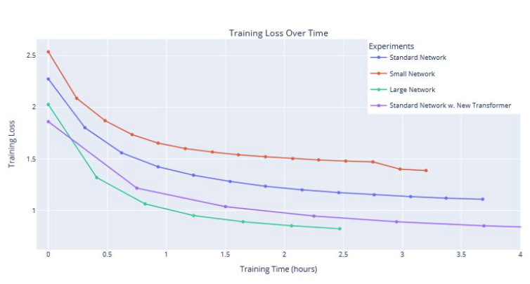

# Textract
An AI/ML project to convert handwritten mathematical expressions into LaTeX code using the CROHME 2023 dataset.

## Project Overview

**Textract** converts raw CROHME-2023 inkml data into rendered images, then experiments with multiple neural-sequence architectures to translate those images into LaTeX code. First,  all `.inkml` stroke files were converted into `.png` bitmaps. Next, a unified PyTorch dataset was built that tokenizes every LaTeX annotation, pads sequences, and applies standard image transforms. Finally, the four encoder–decoder variants were compared with each other:

1. **CNN–GRU Baseline**: A small three-layer convolutional feature extractor whose pooled output is added to token embeddings and fed into a single-layer GRU.  
2. **ResNet34 + LSTM + Attention**: A pretrained ResNet34 backbone projected into a 256-dim feature map, with a two-layer LSTM and additive attention over its spatial grid.  
3. **Large LSTM**: Same as above but with a 512-dim feature projection and three LSTM layers (uses the pretrained ResNet34 backbone).  
4. **Transformer Decoder**: Replaces the LSTM with a three-layer Transformer decoder (8 heads, 1024-dim feed-forward) on top of the 256-dim ResNet34 features, using both image and token positional encodings for fully self-attention-driven generation.

All variants are trained with Adam, gradient clipping, LR reduction on plateau, and early stopping. This repo contains scripts for preprocessing, training, inference (greedy or beam search), and visualization of attention and TensorBoard curves.

## Project Demo

Click the thumbnail below to watch a short demo of TextRact in action:

[](https://youtu.be/kF_Qodtkdns)

## Results
  
*Figure 1: Training loss curves showing the same ordering: CNN–GRU settles near 1.4, standard LSTM near 1.1, Large LSTM dips to 0.8, and Transformer reaches ~0.85.*

  
*Figure 2: Validation accuracy curves for all four models. The Large LSTM peaks at ~0.77, while the Transformer variant converges smoothly to ~0.75.*

  
*Table 1: Summary of model hyperparameters: encoder/decoder dimensions, number of layers, batch size, and pretrained backbone usage.*

## Project Structure

### Setup
#### Prerequisites
- Python 3.8+
- To download required packages:
```bash
pip install -r requirements.txt
```

#### Downloading Data
Please visit the [CROHME Website](https://crohme2023.ltu-ai.dev/data-tools/) to learn more about the dataset and the [Downloader](https://zenodo.org/records/8428035) to download the required dataset. Please download the "CROHME23.zip" file (~1.8 GB). Place this zip file in the "data" folder within the repo:

For example,
```
data/
└── CROHME23.zip
```

#### Some Information about the Data
The CROHME 2023 dataset includes:
- Real handwritten expressions from previous CROHME competitions
- 150k+ artificially generated expressions
- Both online (stroke) and offline (image) data
- Train/validation/test splits

Note: Some artificial data files may fail to parse due to encoding issues. This is normal and doesn't affect the core dataset quality.

### Phase 1: Converting .inkml Files into .png Files
Please run this command to convert the data file types.
```bash
python data_extraction/convert_to_image.py
```

### Phase 2: Building CROHME Dataset for Model
```dataset.py``` builds two main classes: ```LaTeXVocab``` and  ```CROHMEDataset```

```LaTeXVocab```:
- Tokenizes LaTeX expressions for easy sequencing
- seamless changes for encoding and decoding
- Can also save the vocabulary of a particular input

```CROHMEDataset```:
- Loading and handling the necessary dataloader functions
- Creation of dataloaders for necessary data partitions (train, validation, test)

### Phase 3: Model Architecture and Training

#### Model Architecture
Model resides within ```models.py```

Pipeline from input to output:
- Input Image → CNN Encoder → Feature Maps → LSTM Decoder with Attention → LaTeX Output

Four main classes:
- ```PositionEncoding``` (additive for our CNN model)
- ```ImageEncoder``` (our CNN model)
- ```Attention``` (additive for our LSTM model)
- ```LatexDecoder``` (our LSTM model)

```PositionEncoding```:
- Adds spatial information to CNN features so the model knows where each feature is located
- Creates unique signatures for each position using sin/cos waves
- Different frequencies capture coarse and fine location
- Added to features so that identical symbols at different positions can be distinguished

```ImageEncoder```:
- Extracts visual features from the handwritten math image
- Traditional CNN architecture with the addition of a ResNet34 backbone and a positional encoding feature

```Attention```:
- Helps the decoder look at relevant parts of the image when generating each LaTeX token
- Quick example:
  - Hidden state encodes "I just generated x, looking for what's next"
  - Attention scores peak at the superscript position
  - Context vector contains features from that position

```LatexDecoder```:
- Generates LaTeX tokens one at a time using an LSTM with attention
  - Gets the current token embedding
  - Uses attention to look at the image
  - Combines embedding and visual context
  - LSTM processes this information
  - Then it gets projected to vocabulary
 
Thus, the simplified understanding is:
1. ```PositionEncoding``` preserves spatial relationships
2. ```ImageEncoder``` provides a spatial map of features
3. ```Attention``` selects relevant regions dynamically
4. ```LatexDecoder``` maintains state and generates a sequence


Dimensions over each model from input to output:
1. Input image: [batch, 3, 224, 224]
2. After ResNet34: [batch, 512, 7, 7]
3. After consistent convolutional layers and positional encoding: [batch, 256, 7, 7]
4. After flattening encoded feature extraction: [batch, 49, 256]
5. After attention fixes every position to a single score (weights): [batch, 49]
6. After LSTM gets context for every position (context): [batch, 256]
7. Combine context with attention weights:  [batch, 512]
8. Project to the vocab size of the input: [batch, vocab_size]
9. Then attempts to predict each possible token in sequence

#### Training the model
You can train the model on the data by running
```bash
python src/training.py
```
You can add additional specifications for input and output directories, as well as other parameters, although they have default values.

### Phase 4: Testing the model
You can test the model by running
```bash
python src/inference.py
```
Please make sure to provide --image for single image (INCLUDE THE IMAGE FILEPATH) or --test for test set evaluation.
